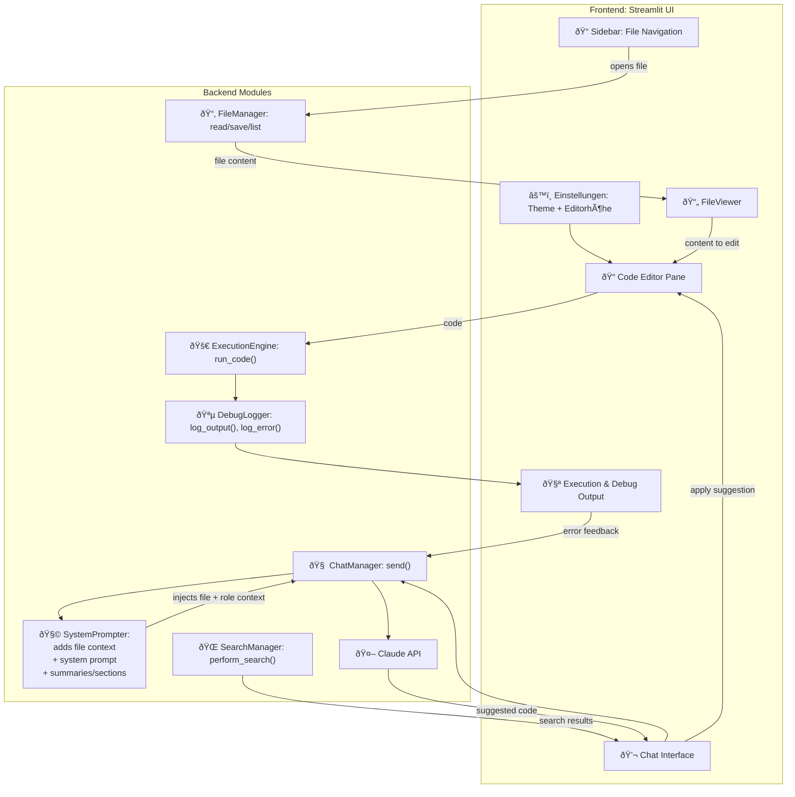

# Architekturübersicht

```mermaid
graph TD
  %% UI Layer
  subgraph UI_Frontend ["Frontend: Streamlit UI"]
    Sidebar["📠Sidebar: File Navigation"]
    Settings["âš™ï¸ Einstellungen: Theme + Editorhöhe"]
    Editor["📠Code Editor Pane"]
    Viewer["📄 FileViewer"]
    Chat["💬 Chat Interface"]
    Output["🧪 Execution & Debug Output"]
  end

  %% Backend Modules
  subgraph Backend_Modules ["Backend Modules"]
    FM["📂 FileManager: read/save/list"]
    CE["🚀 ExecutionEngine: run_code()"]
    DL["🪵 DebugLogger: log_output(), log_error()"]
    CM["🧠 ChatManager: send()"]
    SP["🧩 SystemPrompter:
adds file context
+ system prompt
+ summaries/sections"]
    SM["🌠SearchManager: perform_search()"]
    Claude["🤖 Claude API"]
  end

  %% Interactions
  Settings --> Editor
  Sidebar -->|opens file| FM
  FM -->|file content| Viewer
  Viewer -->|content to edit| Editor
  Editor -->|code| CE
  CE --> DL
  DL --> Output

  Chat --> CM
  CM --> SP
  SP -->|injects file + role context| CM
  SM -->|search results| Chat
  Output -->|error feedback| CM
  CM --> Claude
  Claude -->|suggested code| Chat
  Chat -->|apply suggestion| Editor
```
